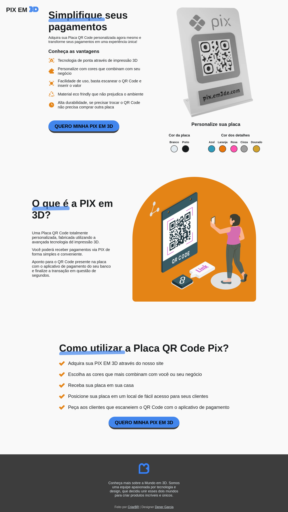
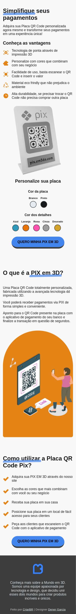

# Landing Page Pix em 3D

Uma landing page para captar leads e direcionar para compra uma placa qr code personalizada por impressão 3D.

🖥️ Versão web                                                   |  📱 Versão Mobile
:----------:                                                    |  :--------------:
  |  

## 🔥 Funcionalidades
- ✅ Design Responsivo
- ✅ Animação com SVG
- ✅ Micro interações com Vanilla JS

## ⬇️ Rodando o projeto

1. Clone esse repositório ou faça o download dos arquivos para sua máquina.
2. Abra o VS Code dentro da pasta do projeto
3. Instale no VS Code a extensão [Live Server](https://marketplace.visualstudio.com/items?itemName=ritwickdey.LiveServer)
4. Inicie o live server e pronto

## 🖥️ Tecnologías Utilizadas:

  
  
  
  
  

## 🤔 Aprendizados

Criar uma landing page em curto prazo, trabalhar com a propriedade data em tags HTML, o foco é trazer leads e ter uma página com um design agradável e responsivo.

## 🖧 Vamos nos conectar?

  
    
  
    
  
    
  
    
  

